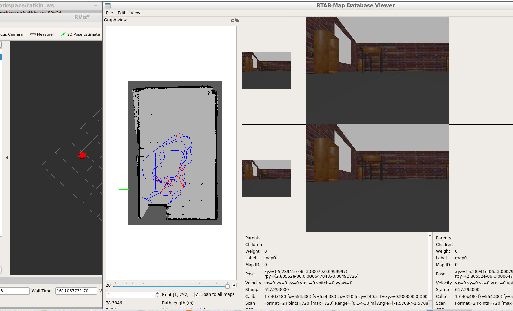

# Udacity Map My World
Project for udacity nanodegree Robotics Software Engineer

### This folder contains the required structure files generated in the Udacity "Map my world" Udacity project.

Developed by **Rodrigo Montebello Saboya Brito** and the help of the internet including *Ros wiki and Udacity git hub repos*

### Objectives:
  **You will develop your own package to interface with the rtabmap_ros package.**

  **You will build upon your localization project to make the necessary changes to interface the robot with RTAB-Map. An example of this is the addition of an RGB-D camera.**

  **You will ensure that all files are in the appropriate places, all links are properly connected, naming is properly setup and topics are correctly mapped. Furthermore you will need to generate the appropriate launch files to launch the robot and map its surrounding environment.**

  **When your robot is launched you will "teleop" around the room to generate a proper map of the environment.**

### Reference sources:
#### Ros wiki: (http://wiki.ros.org/ROS/Tutorials)
> Udacity peer repos:
>> https://github.com/dudasdavid/Udacity-Robotics-SLAM
